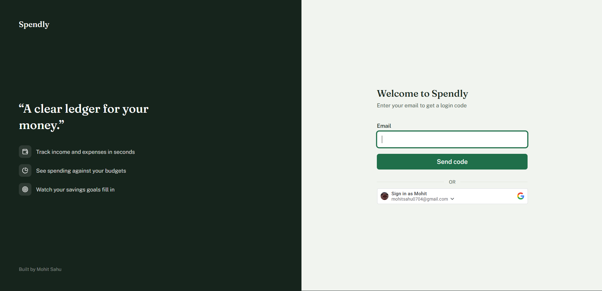
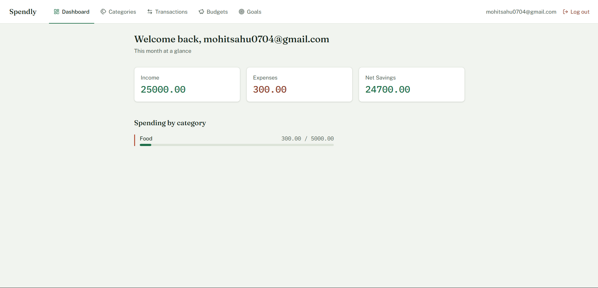

# Spendly

A full-stack personal expense tracker. Track income and expenses, set monthly
budgets per category, follow savings goals, and see a real-time spending
summary. Built as a from-scratch rebuild focused on proper system design:
tenant-ready data architecture, per-user data isolation, and a clean
frontend/backend boundary.

## Live demo

- **App**: https://spendly-lime-one.vercel.app
- **API**: https://spendly-backend-92a0.onrender.com

**Note on email login:** the deployed app uses Resend's free-tier sandbox
sender, which only delivers to the account owner's own email until a
custom domain is verified. **Google Sign-In works fully for anyone** and
is the easiest way to try the live demo. Email OTP login works correctly
in code and is fully testable locally (see setup below) — the restriction
is a free-tier email deliverability limit, not an application bug.

## Screenshots

 

## Tech stack

**Backend** — Java 17, Spring Boot 3, Spring Security, Spring Data JPA,
PostgreSQL, Flyway (versioned migrations), JWT (jjwt), Google API Client
(OAuth token verification), Gradle

**Frontend** — Next.js 15 (App Router), TypeScript, Tailwind CSS 4, React
Compiler

**Infra** — Docker Compose (local Postgres)

## Features

- **Auth**: email/password registration and login, plus Google Sign-In
  (Google Identity Services, ID token verified server-side)
- **Categories**: user-defined income/expense categories
- **Transactions**: full CRUD, paginated, linked to a category
- **Budgets**: monthly spending limits per category
- **Goals**: savings targets with progress tracking
- **Dashboard**: server-computed monthly summary (income, expenses, net
  savings) and per-category spend-vs-budget breakdown

## Architecture highlights

See [`docs/ARCHITECTURE.md`](docs/ARCHITECTURE.md) for the full write-up.
The short version:

- **Tenant-ready from day one** — every table carries a `tenant_id`, even
  though the app runs single-tenant today. Multi-tenancy (e.g. shared
  household budgets) becomes an auth change, not a schema rewrite.
- **Per-user data isolation** — every query is scoped by both `tenant_id`
  and `user_id`, enforced consistently at the repository layer.
- **Clean layering** — Controller → Service → Repository, with DTOs as a
  hard boundary between what's stored and what's exposed over the API.
- **Stateless JWT auth** — no server-side sessions; a request-scoped
  `TenantContext` (backed by `ThreadLocal`) makes the current tenant
  available anywhere in the call stack without passing it explicitly.

## Project structure
